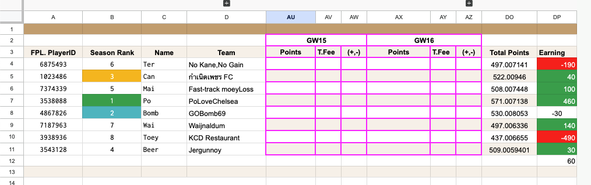
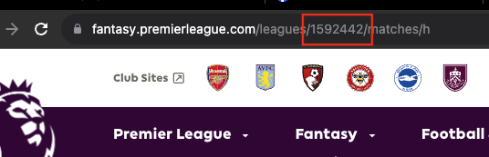

# automate-fpl-sheet

This mini project is used for automate filling out the points for certain FPL league with integraion with FPL APIs. Before getting started you may need to configure a config file as below.

### Prerequistion

- You must create Sheet API integration in GCP and create service account regarding to that service, export it as JSON file, rename it to `service_account.json` place the in the project root directory
- In case that your sheet is not publicly accessible for editing. You must grant an access to service account email

- Your sheet must be in the same format as the following [link](https://docs.google.com/spreadsheets/d/1eciOdiGItEkml98jVLyXysGMtpMa06hbiTTJ40lztw4/edit#gid=1315457538)
  

### Configuration

first of all let's create a config file named "config.json"

`{
        "cookies": "<cookies-from-fpl>",
        "league_id": "<your-league-id>",
        "sheet_url": "https://sheet.url.com",
        "player_ids_range": [1,2,3,4],
        "ignore_players": ["AVERAGE", "SOMEONE"]
}`

- cookies - you can retrieve this from FPL website by copying the value from api request's headers
  
- league_id - you can retrieve this value from your local league page looks at address bar.
  
- player_ids_range - you can determine the range of player ids by looking at your sheet
  
  from the image above by `player_ids_range` is `A4:A11`

### How to run the program?

- Create new virtual environment with any name
- Install dependencies from requirement.txt
- `python main.py --gameweek <1-38>`
