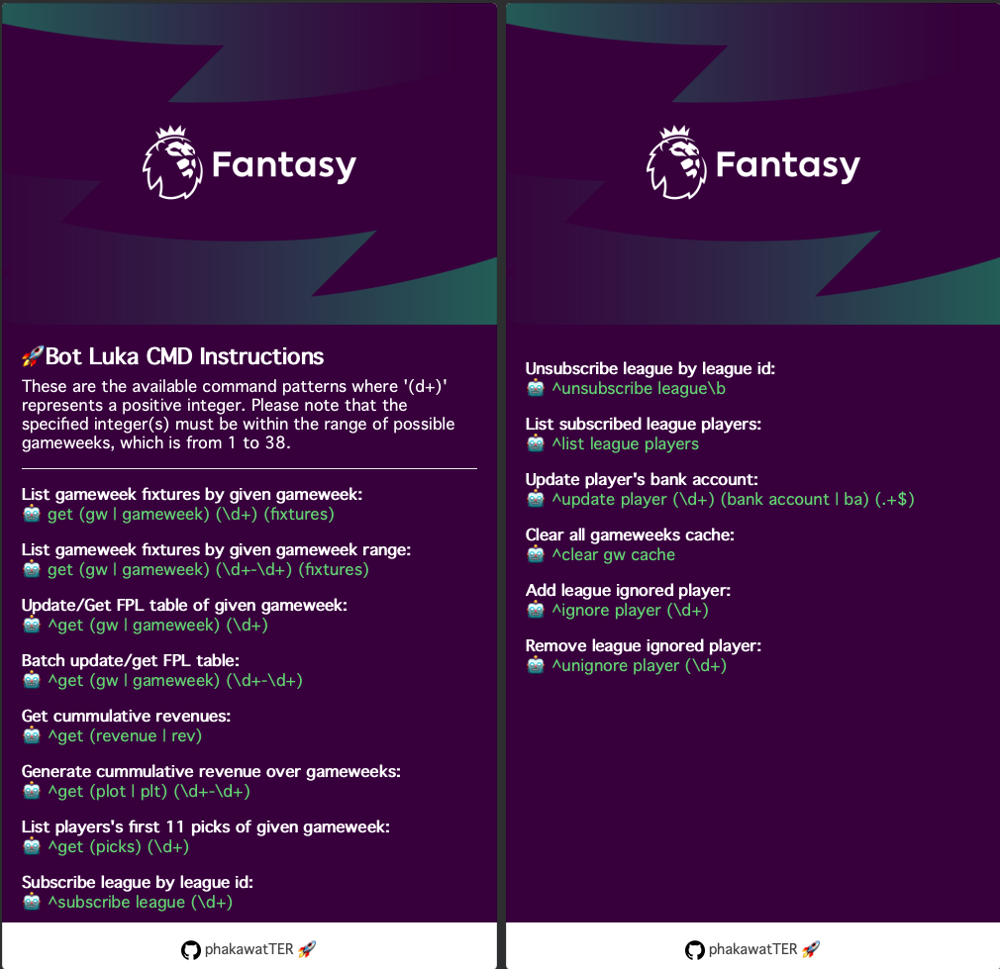
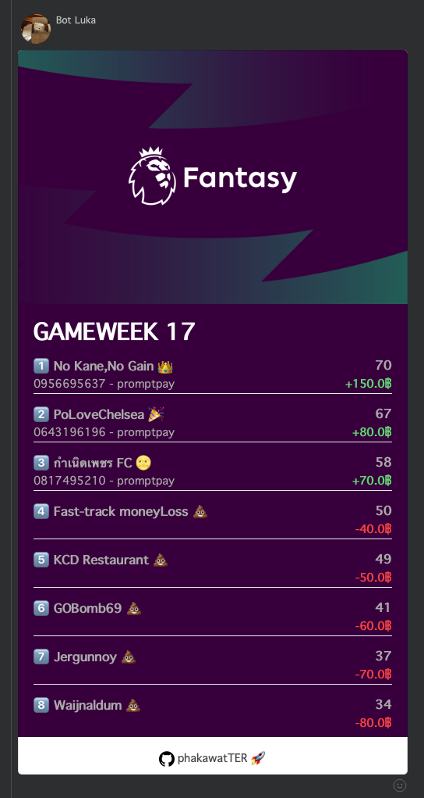
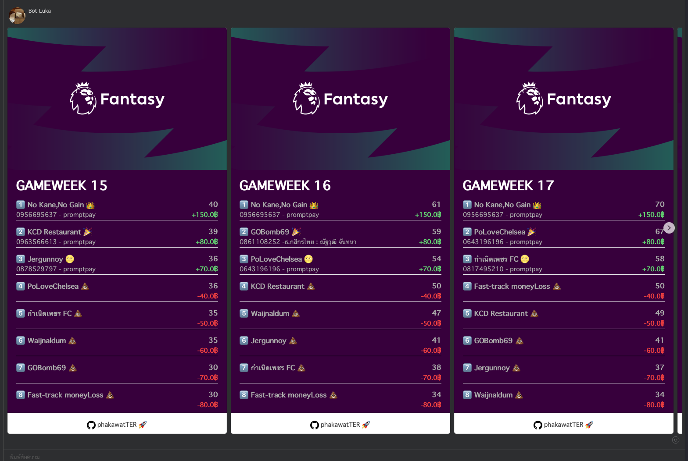
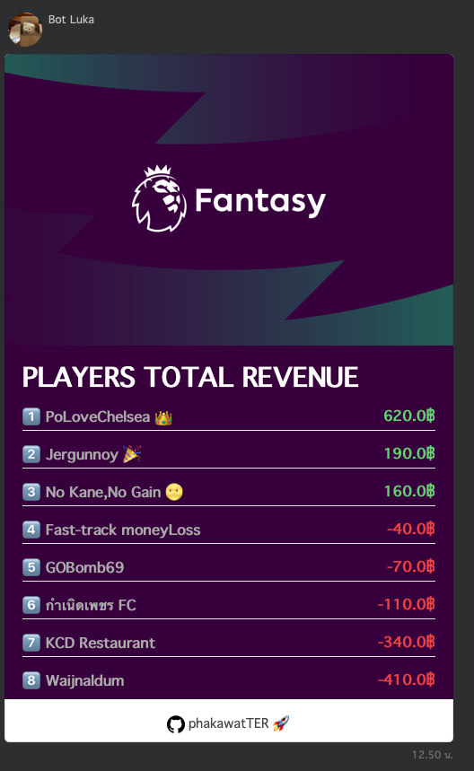
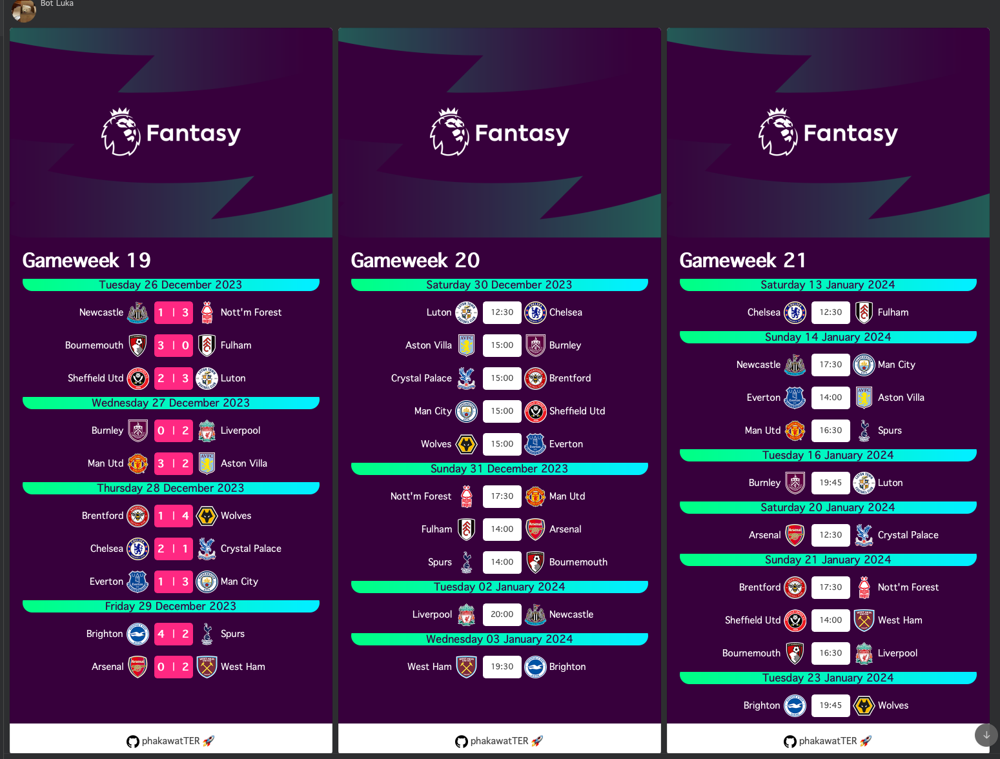

# fpl-line-bot

fpl-line-bot is LINE bot which is integrated with FPL APIs (Fantasy Premiere League). The bot support various command to process and send back flex message back to LINE group.

### List of Commands

List gameweek fixtures by given gameweek:

- get (gw | gameweek) (\d+ (fixtures)

List gameweek fixtures by given gameweek range:

- get (gw | gameweek) (\d+-\d+) (fixtures)

Update/Get FPL table of given gameweek:

- ^get (gw I gameweek) (\d+)

Batch update/get FPL table:

- ^get (gw I gameweek) (\d+-\d+)

Get cumulative revenues:

- ^get (revenue I rev)

Generate cumulative revenue over gameweeks:

- ^get (plot I plt) (\d+-Id+)

List players's first 11 picks of given gameweek:

- ^get (picks) (\d+)

Subscribe league by league id:

- ^subscribe league (\d+)

Unsubscribe leaque by leaque id:

- Aunsubscribe league\b

List subscribed league players:

- list leaque players

Update player's bank account:

- ^update player (\d+) (bank account I ba) (.+$)

Clear all gameweeks cache:

- Aclear gw cache

Add league ignored player:

- ignore player (\d+)

Remove league ignored player:

- Aunignore player (\d+)

## Get Gameweek

## Get Gameweeks Batch Result

## Get Cummulative Revenue Over Gameweeks

## Get Gameweeks Fixtures

